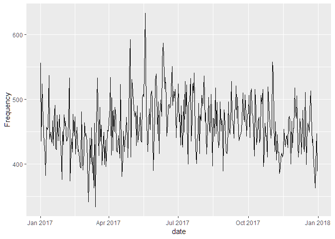
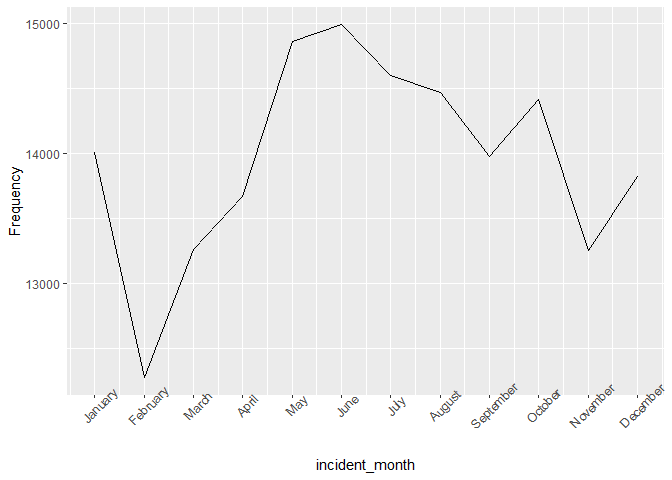
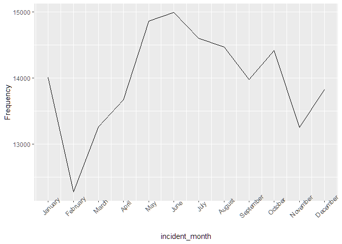
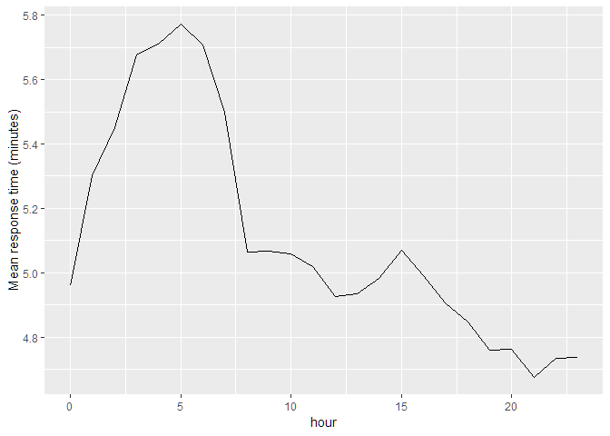

incident\_EDA
================
Team
November 10, 2018

``` r
library(tidyverse)
```

    ## -- Attaching packages ------------------------------------------- tidyverse 1.2.1 --

    ## v ggplot2 3.0.0     v purrr   0.2.5
    ## v tibble  1.4.2     v dplyr   0.7.6
    ## v tidyr   0.8.1     v stringr 1.3.1
    ## v readr   1.1.1     v forcats 0.3.0

    ## -- Conflicts ---------------------------------------------- tidyverse_conflicts() --
    ## x dplyr::filter() masks stats::filter()
    ## x dplyr::lag()    masks stats::lag()

``` r
library(lubridate)
```

    ## 
    ## Attaching package: 'lubridate'

    ## The following object is masked from 'package:base':
    ## 
    ##     date

Loaded and tidied data
----------------------

``` r
incident_dat_2017 <-  
  read_csv('data/Incidents_Responded_to_by_Fire_Companies.csv',
  col_types = "cicccicciccccccccccciccccccc") %>% 
  janitor::clean_names() %>% 
  #recode date/time
  mutate(incident_date_time = mdy_hms(incident_date_time),
         arrival_date_time = mdy_hms(arrival_date_time)) %>% 
  #select year 2017
  filter(year(incident_date_time) == 2017,
         incident_type_desc == "300 - Rescue, EMS incident, other") %>% 
  select(im_incident_key, incident_date_time, arrival_date_time,
         street_highway:borough_desc) %>% 
  na.omit() %>% 

  # Added response time(minute) variable
  # mutate(response_time = arrival_date_time - incident_date_time) %>%
  mutate(response_time = difftime(arrival_date_time, incident_date_time, units = 'mins'),
  # Added hour variable
  hour = hour(incident_date_time),
  date = date(incident_date_time),
  # Added incident_month and incident_day variables from incident_date_time
  incident_date = as.Date(incident_date_time)) %>% 
  separate(incident_date, 
           into = c("incident_year", "incident_month", "incident_day"), 
           sep = "-") %>% 
  select(-incident_year) %>% 
  mutate(incident_month = as.numeric(incident_month),
         incident_day = as.numeric(incident_day))
```

    ## Warning: Unnamed `col_types` should have the same length as `col_names`.
    ## Using smaller of the two.

    ## Warning in rbind(names(probs), probs_f): number of columns of result is not
    ## a multiple of vector length (arg 1)

    ## Warning: 13119 parsing failures.
    ## row # A tibble: 5 x 5 col     row col        expected       actual            file                   expected   <int> <chr>      <chr>          <chr>             <chr>                  actual 1    91 FIRE_SPRE~ no trailing c~ " - Beyond build~ 'data/Incidents_Respo~ file 2   199 FIRE_SPRE~ no trailing c~ " - Confined to ~ 'data/Incidents_Respo~ row 3   440 FIRE_SPRE~ no trailing c~ " - Confined to ~ 'data/Incidents_Respo~ col 4   492 FIRE_SPRE~ no trailing c~ " - Confined to ~ 'data/Incidents_Respo~ expected 5   569 FIRE_SPRE~ no trailing c~ " - Confined to ~ 'data/Incidents_Respo~
    ## ... ................. ... .......................................................................... ........ .......................................................................... ...... .......................................................................... .... .......................................................................... ... .......................................................................... ... .......................................................................... ........ ..........................................................................
    ## See problems(...) for more details.

create frequency by day for the whole year
------------------------------------------

``` r
incident_dat_2017 %>% 
  mutate(date = date(incident_date_time)) %>%
  group_by(date) %>% count() %>%
  ggplot(aes(x = date, y = n)) + geom_line() + labs(y = 'Frequency')
```



Look at monthly trend in EMS rescue incident
--------------------------------------------

``` r
incident_dat_2017 %>% 
  group_by(incident_month) %>% count() %>% 
  ggplot(aes(x = incident_month, y = n)) + geom_line() + 
  theme(axis.text.x = element_text(angle = 45)) +  labs(y = 'Frequency') +
  scale_x_continuous(breaks = 1:12, labels = month.name)
```



Look at hourly trend
--------------------

``` r
incident_dat_2017 %>% 
  group_by(hour) %>% 
  count() %>% 
  ggplot(aes(x = hour, y = n)) + geom_line() + labs(y = 'Frequency')
```



And look at lag time (average) by the hour
==========================================

``` r
incident_dat_2017 %>%
    group_by(hour) %>% 
    summarise(mean_response_time = mean(response_time, na.rm = TRUE)) %>% 
  ggplot(aes(x = hour, y = mean_response_time)) + geom_line() + 
  labs(y = 'Mean response time (minutes)')
```

    ## Don't know how to automatically pick scale for object of type difftime. Defaulting to continuous.



Response time by area(zip\_code)
--------------------------------

``` r
incident_dat_2017 %>%
  group_by(zip_code) %>%
  summarise(mean_response_time = mean(response_time, na.rm = TRUE)) %>% 
  mutate(zip_code = forcats::fct_reorder(zip_code, mean_response_time, 
                                         .asc = TRUE)) %>% 
  ggplot(aes(x = zip_code, y = mean_response_time)) + 
  geom_point(size = .5, color = "darkred") +  
  coord_flip() +
  theme_bw()
```

    ## Don't know how to automatically pick scale for object of type difftime. Defaulting to continuous.


