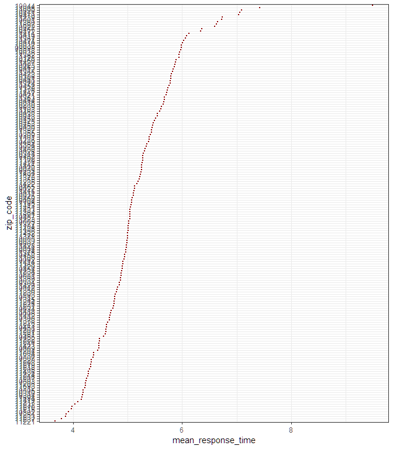
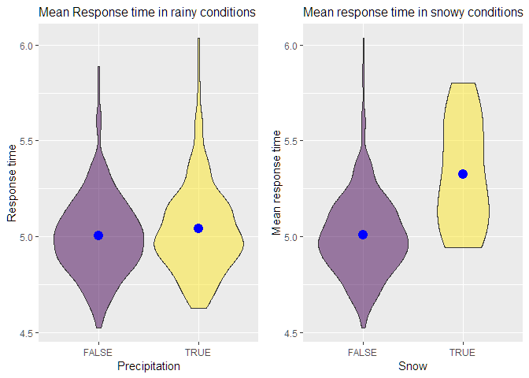
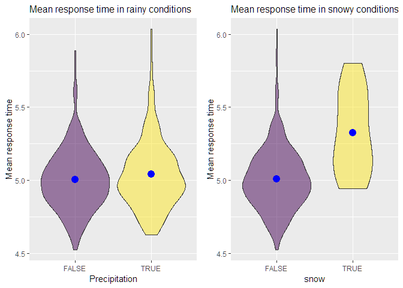

incident\_EDA
================
Team
November 10, 2018

``` r
library(tidyverse)
```

<<<<<<< HEAD
    ## -- Attaching packages ----------------------------------------------------------------------------------------------------- tidyverse 1.2.1 --
=======
    ## -- Attaching packages ------------------------------------------- tidyverse 1.2.1 --
>>>>>>> 92eac248816c62655f25d8dd0f608b498be4c3e0

    ## v ggplot2 3.0.0     v purrr   0.2.5
    ## v tibble  1.4.2     v dplyr   0.7.6
    ## v tidyr   0.8.1     v stringr 1.3.1
    ## v readr   1.1.1     v forcats 0.3.0

<<<<<<< HEAD
    ## -- Conflicts -------------------------------------------------------------------------------------------------------- tidyverse_conflicts() --
=======
    ## -- Conflicts ---------------------------------------------- tidyverse_conflicts() --
>>>>>>> 92eac248816c62655f25d8dd0f608b498be4c3e0
    ## x dplyr::filter() masks stats::filter()
    ## x dplyr::lag()    masks stats::lag()

``` r
library(lubridate)
```

    ## 
    ## Attaching package: 'lubridate'

    ## The following object is masked from 'package:base':
    ## 
    ##     date

``` r
library(xml2)
library(rvest)
```

    ## 
    ## Attaching package: 'rvest'

    ## The following object is masked from 'package:purrr':
    ## 
    ##     pluck

    ## The following object is masked from 'package:readr':
    ## 
    ##     guess_encoding

``` r
library(patchwork)
```

Response time data - Loaded and tidied data
-------------------------------------------

``` r
incident_dat_2017 <-  
  read_csv('data/Incidents_Responded_to_by_Fire_Companies.csv',
  col_types = "cicccicciccccccccccciccccccc") %>% 
  janitor::clean_names() %>% 
  #recode date/time
  mutate(incident_date_time = mdy_hms(incident_date_time),
         arrival_date_time = mdy_hms(arrival_date_time)) %>% 
  #select year 2017
  filter(year(incident_date_time) == 2017,
         incident_type_desc == "300 - Rescue, EMS incident, other") %>% 
  select(im_incident_key, incident_date_time, arrival_date_time,
         street_highway:borough_desc) %>% 
  na.omit() %>% 

  # Added response time(minute) variable
  # mutate(response_time = arrival_date_time - incident_date_time) %>%
  mutate(response_time = difftime(arrival_date_time, incident_date_time, units = 'mins'),
  # Added hour variable
  hour = hour(incident_date_time),
  date = date(incident_date_time),
  # Added incident_month and incident_day variables from incident_date_time
  incident_date = as.Date(incident_date_time)) %>% 
  separate(incident_date, 
           into = c("incident_year", "incident_month", "incident_day"), 
           sep = "-") %>% 
  select(-incident_year) %>% 
  mutate(incident_month = as.numeric(incident_month),
         incident_day = as.numeric(incident_day))
```

    ## Warning: Unnamed `col_types` should have the same length as `col_names`.
    ## Using smaller of the two.

    ## Warning in rbind(names(probs), probs_f): number of columns of result is not
    ## a multiple of vector length (arg 1)

    ## Warning: 13119 parsing failures.
    ## row # A tibble: 5 x 5 col     row col        expected       actual            file                   expected   <int> <chr>      <chr>          <chr>             <chr>                  actual 1    91 FIRE_SPRE~ no trailing c~ " - Beyond build~ 'data/Incidents_Respo~ file 2   199 FIRE_SPRE~ no trailing c~ " - Confined to ~ 'data/Incidents_Respo~ row 3   440 FIRE_SPRE~ no trailing c~ " - Confined to ~ 'data/Incidents_Respo~ col 4   492 FIRE_SPRE~ no trailing c~ " - Confined to ~ 'data/Incidents_Respo~ expected 5   569 FIRE_SPRE~ no trailing c~ " - Confined to ~ 'data/Incidents_Respo~
    ## ... ................. ... .......................................................................... ........ .......................................................................... ...... .......................................................................... .... .......................................................................... ... .......................................................................... ... .......................................................................... ........ ..........................................................................
    ## See problems(...) for more details.

Street closure data - Loaded and tidied data
--------------------------------------------

``` r
street_closure_2017 <-  
  read_csv('data/Street_Closures_due_to_construction_activities_by_Intersection.csv') %>% 
  janitor::clean_names() %>% 
  #recode date/time
  mutate(work_start_date = mdy_hms(work_start_date),
         work_end_date = mdy_hms(work_end_date),
         work_time = round(difftime(work_end_date, work_start_date, 
                                    units = 'days'), 0)) %>% 
  #select year 2017
  filter(year(work_start_date) == 2017) %>% 
  select(-purpose) %>% 
  na.omit() 
```

    ## Parsed with column specification:
    ## cols(
    ##   NODEID = col_integer(),
    ##   ONSTREETNAME = col_character(),
    ##   FROMSTREETNAME = col_character(),
    ##   BOROUGH_CODE = col_character(),
    ##   WORK_START_DATE = col_character(),
    ##   WORK_END_DATE = col_character(),
    ##   PURPOSE = col_character()
    ## )

create frequency by day for the whole year
------------------------------------------

``` r
incident_dat_2017 %>% 
  mutate(date = date(incident_date_time)) %>%
  group_by(date) %>% count() %>%
  ggplot(aes(x = date, y = n)) + geom_line() + labs(y = 'Frequency')
```


Look at monthly trend in EMS rescue incident
--------------------------------------------

``` r
incident_dat_2017 %>% 
  group_by(incident_month) %>% count() %>% 
  ggplot(aes(x = incident_month, y = n)) + geom_line() + 
  theme(axis.text.x = element_text(angle = 45)) +  labs(y = 'Frequency') +
  scale_x_continuous(breaks = 1:12, labels = month.name)
```


Look at hourly trend
--------------------

``` r
incident_dat_2017 %>% 
  group_by(hour) %>% 
  count() %>% 
  ggplot(aes(x = hour, y = n)) + geom_line() + labs(y = 'Frequency')
```


And look at lag time (average) by the hour
==========================================

``` r
incident_dat_2017 %>%
    group_by(hour) %>% 
    summarise(mean_response_time = mean(response_time, na.rm = TRUE)) %>% 
  ggplot(aes(x = hour, y = mean_response_time)) + geom_line() + 
  labs(y = 'Mean response time (minutes)')
```

    ## Don't know how to automatically pick scale for object of type difftime. Defaulting to continuous.


Response time by area(zip\_code)
--------------------------------

``` r
incident_dat_2017 %>%
  group_by(zip_code) %>%
  summarise(mean_response_time = mean(response_time, na.rm = TRUE)) %>% 
  mutate(zip_code = forcats::fct_reorder(zip_code, mean_response_time, 
                                         .asc = TRUE)) %>% 
  ggplot(aes(x = zip_code, y = mean_response_time)) + 
  geom_point(size = .5, color = "darkred") +  
  coord_flip() +
  theme_bw()
```

    ## Don't know how to automatically pick scale for object of type difftime. Defaulting to continuous.



&lt;&lt;&lt;&lt;&lt;&lt;&lt; HEAD

======= \#\# Extract ZIP Code Definitions of New York City Neighborhoods

``` r
url = "https://www.health.ny.gov/statistics/cancer/registry/appendix/neighborhoods.htm?fbclid=IwAR3N4VlKC1OehRZyEuDYPEAE7AFAEXXIRC11seIBKxA-0fd3g4hL0QvnV20"
xml = read_html(url)

zip_code_table = 
  (xml %>% html_nodes(css = "table")) %>% 
  .[[1]] %>%
  html_table() %>% 
  janitor::clean_names() %>%  
  select(neighborhood, zip_codes) %>% 
  separate(zip_codes, c("a", "b", "c", "d", "e", "f", "g", "h", "i"), 
           sep = ",") %>% 
  gather(key = to_remove, value = zip_code, a:i) %>% 
  select(-to_remove) %>% 
  na.omit() %>% 
  distinct() %>% 
  mutate(zip_code = as.numeric(zip_code))
```

    ## Warning: Expected 9 pieces. Missing pieces filled with `NA` in 41 rows [1,
    ## 2, 3, 4, 5, 6, 7, 8, 9, 10, 11, 12, 13, 14, 15, 16, 17, 18, 19, 20, ...].

Add neighborhood variable
-------------------------

``` r
# To match zip_code to neighborhood table, converted it to numeric
incident_dat_2017 = 
  incident_dat_2017 %>% 
    mutate(zip_code = as.numeric(zip_code)) 

incident_dat_2017 =  
  left_join(incident_dat_2017, zip_code_table, by = "zip_code") 
```

Response time by area(neighborhood)
-----------------------------------

``` r
incident_dat_2017 %>%
  na.omit(neighborhood) %>% 
  group_by(neighborhood) %>%
  summarise(mean_response_time = mean(response_time, na.rm = TRUE)) %>% 
  mutate(neighborhood = forcats::fct_reorder(neighborhood, mean_response_time, 
                                         .asc = TRUE)) %>% 
  ggplot(aes(x = neighborhood, y = mean_response_time)) + 
  geom_point(size = 1, color = "darkred") +  
  coord_flip() +
  theme_bw()
```

    ## Don't know how to automatically pick scale for object of type difftime. Defaulting to continuous.


Importing the weather data
--------------------------

``` r
library(rnoaa)

nyc_weather_2017 = 
  rnoaa::meteo_pull_monitors("USW00094728", 
                             var = c("PRCP", "TMIN", "TMAX", "SNOW", "SNWD"), 
                             date_min = "2017-01-01", 
                             date_max = "2017-12-31"
                             ) %>% 
  mutate(tmin = tmin/10, tmax = tmax/10, prcp = prcp/10) %>% 
  select(-id)
```

Combined data with weather data
-------------------------------

``` r
incident_dat_2017 = 
  left_join(incident_dat_2017, nyc_weather_2017, by = "date")
```

EDA -- mean response time and mean variables from weather data
--------------------------------------------------------------

``` r
summary_mean = 
incident_dat_2017 %>% 
  group_by(date) %>% 
  summarise(mean_response_time = mean(response_time, na.rm = TRUE),
            mean_prcp = mean(prcp, na.rm = TRUE),
            mean_snow = mean(snow, na.rm = TRUE),
            mean_snwd = mean(snwd, na.rm = TRUE),
            mean_tmax = mean(tmax, na.rm = TRUE),
            mean_tmin = mean(tmin, na.rm = TRUE))
```

``` r
summary_mean %>% 
  filter(mean_prcp > 0) %>% 
  ggplot(aes(x = mean_prcp, y = mean_response_time)) +
  geom_point() + 
  geom_smooth()
```

    ## Don't know how to automatically pick scale for object of type difftime. Defaulting to continuous.

    ## `geom_smooth()` using method = 'loess' and formula 'y ~ x'


``` r
summary_mean %>%  
  ggplot(aes(x = mean_snow, y = mean_response_time)) +
  geom_point() + 
  geom_smooth()
```

    ## Don't know how to automatically pick scale for object of type difftime. Defaulting to continuous.

    ## `geom_smooth()` using method = 'loess' and formula 'y ~ x'

    ## Warning in simpleLoess(y, x, w, span, degree = degree, parametric =
    ## parametric, : at -1.195

    ## Warning in simpleLoess(y, x, w, span, degree = degree, parametric =
    ## parametric, : radius 1.428

    ## Warning in simpleLoess(y, x, w, span, degree = degree, parametric =
    ## parametric, : all data on boundary of neighborhood. make span bigger

    ## Warning in simpleLoess(y, x, w, span, degree = degree, parametric =
    ## parametric, : pseudoinverse used at -1.195

    ## Warning in simpleLoess(y, x, w, span, degree = degree, parametric =
    ## parametric, : neighborhood radius 1.195

    ## Warning in simpleLoess(y, x, w, span, degree = degree, parametric =
    ## parametric, : reciprocal condition number 1

    ## Warning in simpleLoess(y, x, w, span, degree = degree, parametric =
    ## parametric, : zero-width neighborhood. make span bigger

    ## Warning: Computation failed in `stat_smooth()`:
    ## NA/NaN/Inf in foreign function call (arg 5)


``` r
summary_mean %>% 
  filter(mean_snwd > 0) %>%
  ggplot(aes(x = mean_snwd, y = mean_response_time)) +
  geom_point() + 
  geom_smooth()
```

    ## Don't know how to automatically pick scale for object of type difftime. Defaulting to continuous.

    ## `geom_smooth()` using method = 'loess' and formula 'y ~ x'


``` r
summary_mean %>% 
  ggplot(aes(x = mean_tmax, y = mean_response_time)) +
  geom_point() + 
  geom_smooth()
```

    ## Don't know how to automatically pick scale for object of type difftime. Defaulting to continuous.

    ## `geom_smooth()` using method = 'loess' and formula 'y ~ x'



``` r
summary_mean %>% 
  ggplot(aes(x = mean_tmin, y = mean_response_time)) +
  geom_point() + 
  geom_smooth()
```

    ## Don't know how to automatically pick scale for object of type difftime. Defaulting to continuous.

    ## `geom_smooth()` using method = 'loess' and formula 'y ~ x'


EDA -- yes or no
----------------

``` r
resp_time_prcp = 
summary_mean %>% 
  mutate(prcp = mean_prcp > 0) %>% 
  ggplot(aes(x = prcp, y = mean_response_time)) +
  geom_violin(aes(fill = factor(prcp)), alpha = .5) +
  stat_summary(fun.y = mean, geom = "point", size = 4, color = "blue") +
  labs(
    title = "Mean response time in rainy conditions",
    x = "Precipitation",
    y = "Mean response time"
  ) +
  viridis::scale_fill_viridis(
    name = "Precipitation",
    discrete = TRUE) +
  theme(plot.title = element_text(size = 12),
        strip.background = element_rect(fill = "black"),
        strip.text = element_text(color = "white", face = "bold"),
        legend.position = "None") 

resp_time_snow = 
summary_mean %>% 
  mutate(snow = mean_snow > 0) %>% 
  ggplot(aes(x = snow, y = mean_response_time)) +
  geom_violin(aes(fill = factor(snow)), alpha = .5) +
  stat_summary(fun.y = mean, geom = "point", size = 4, color = "blue") +
  labs(
    title = "Mean response time in snowy conditions",
    y = "Mean response time"
  ) +
  viridis::scale_fill_viridis(
    name = "Snow",
    discrete = TRUE) +
  theme(plot.title = element_text(size = 12),
        strip.background = element_rect(fill = "black"),
        strip.text = element_text(color = "white", face = "bold"),
        legend.position = "None") 

resp_time_prcp + resp_time_snow
```

    ## Don't know how to automatically pick scale for object of type difftime. Defaulting to continuous.
    ## Don't know how to automatically pick scale for object of type difftime. Defaulting to continuous.



Mean response time seems related to snow but not precipitation.
