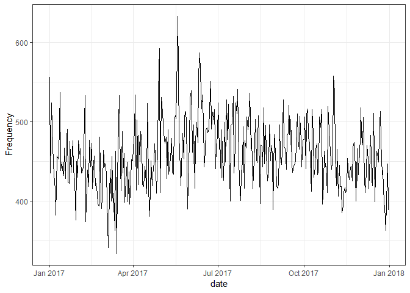
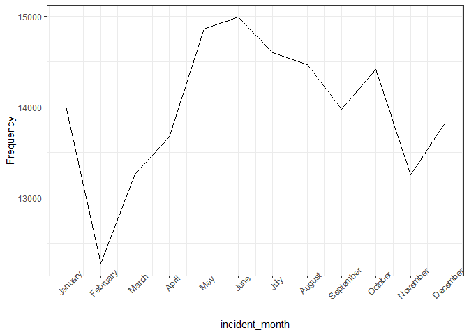
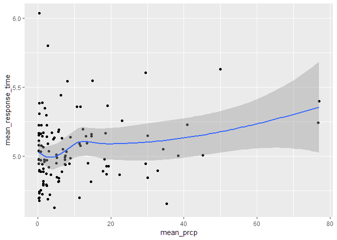
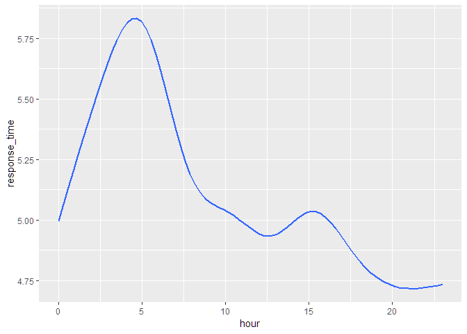
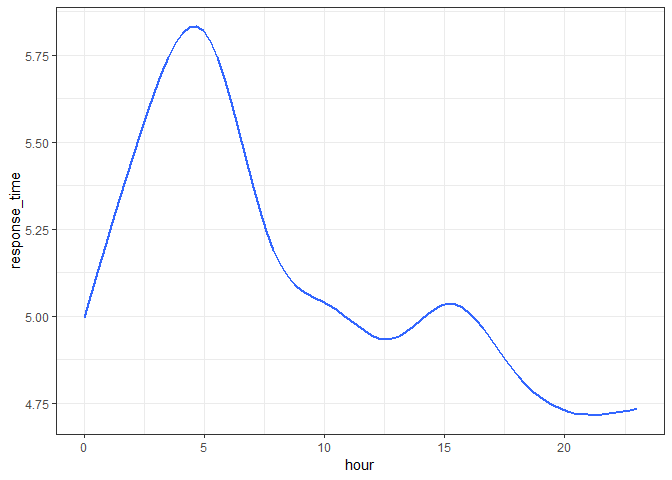
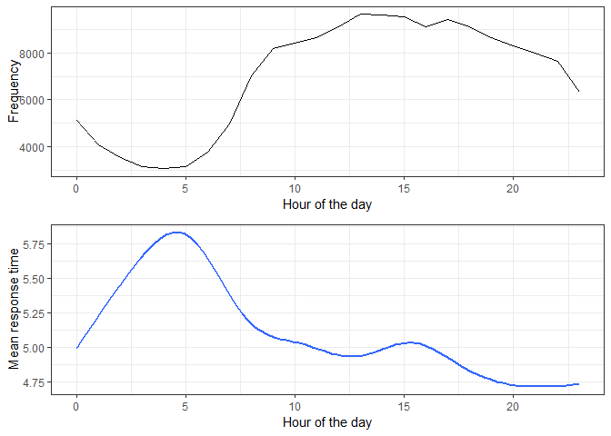
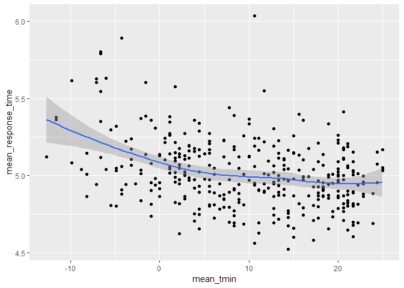
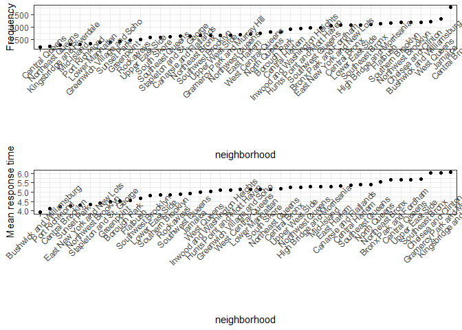

incident\_EDA
================
Team
November 10, 2018

``` r
library(tidyverse)
```

    ## -- Attaching packages ----------------------------------------------------------------------------- tidyverse 1.2.1 --

    ## v ggplot2 3.0.0     v purrr   0.2.5
    ## v tibble  1.4.2     v dplyr   0.7.6
    ## v tidyr   0.8.1     v stringr 1.3.1
    ## v readr   1.1.1     v forcats 0.3.0

    ## -- Conflicts -------------------------------------------------------------------------------- tidyverse_conflicts() --
    ## x dplyr::filter() masks stats::filter()
    ## x dplyr::lag()    masks stats::lag()

``` r
library(lubridate)
```

    ## 
    ## Attaching package: 'lubridate'

    ## The following object is masked from 'package:base':
    ## 
    ##     date

``` r
library(xml2)
library(rvest)
```

    ## 
    ## Attaching package: 'rvest'

    ## The following object is masked from 'package:purrr':
    ## 
    ##     pluck

    ## The following object is masked from 'package:readr':
    ## 
    ##     guess_encoding

``` r
library(patchwork)
library(viridis)
```

    ## Loading required package: viridisLite

``` r
library(ggmap)
library(jpeg)
library(grid)
```

##### Data sets

Response time data - Loaded and tidied data
-------------------------------------------

adding a graph overlap with response time
-----------------------------------------

``` r
#Overlapping plots on map for EDA (abhishek)
nyc_pic = readJPEG("nyc-boroughs-map.jpg")

zip_coor = read.csv("./data/US Zip Codes from 2013 Government Data")

zip_coor =
  zip_coor %>% 
  janitor::clean_names() %>% 
  rename(zip_code = zip, long = lng)
  
incident_zip_coor = merge(incident_dat_2017, zip_coor)

map_overlap = 
  incident_zip_coor %>%
  group_by(zip_code) %>% 
  mutate(response_time = as.numeric(response_time)) %>%
  mutate(mean_res_time = mean(response_time)) %>% 
  ggplot(aes(x = long, y = lat, size = mean_res_time, color = mean_res_time)) +
  annotation_custom(rasterGrob(nyc_pic, 
                               width = unit(1,"npc"), 
                               height = unit(1,"npc")), 
                               -Inf, Inf, -Inf, Inf) +
  geom_point() +
  viridis::scale_color_viridis() + theme_set(theme_bw() + theme(legend.position = "bottom"))


ggsave("map_overlap.jpg", map_overlap, width = 8, height = 5)
```

Added neighborhood variable
---------------------------

Add weather-related variable
----------------------------

Added prcp category variable
----------------------------

Added season variable
---------------------

``` r
incident_season = 
  incident_dat_2017 %>%
  mutate(season = 
           ifelse(incident_month %in% 9:11, "Fall",
           ifelse(incident_month %in% c(12,1,2), "Winter",
           ifelse(incident_month %in% 3:5, "Spring", "Summer"))))
```

Added incident response time category variable
----------------------------------------------

``` r
incident_by_date = 
  incident_dat_2017 %>% 
  group_by(zip_code, date) %>% 
  summarize(n_incident = n())  
  
incident_by_zipcode = 
  incident_dat_2017 %>% 
  group_by(zip_code, date) %>% 
  summarize(n_incident = n()) %>% 
  ungroup() %>% 
  group_by(zip_code) %>% 
  summarize(mean_incident = mean(n_incident),
            sd_incident = sd(n_incident),
            std_high_incident = mean_incident + sd_incident,
            std_low_incident = mean_incident - sd_incident)

incident_response_time =
  incident_dat_2017 %>% 
  group_by(zip_code) %>% 
  select(zip_code, response_time, date) 

incident_category_data = 
  left_join(incident_by_date, incident_by_zipcode, by = "zip_code") %>% 
  mutate(incident_category = 
           ifelse(((n_incident - std_high_incident) > 0), "high", 
           ifelse(((std_low_incident - n_incident) > 0), "low", "medium"))) %>% 
  select(zip_code, date, incident_category)

incid_cate_joined_data = 
  inner_join(incident_dat_2017, incident_category_data) %>% 
  na.omit() 
```

    ## Joining, by = c("zip_code", "date")

added hour of the day variable
------------------------------

``` r
incident_hour_of_day = 
  incident_dat_2017 %>% 
  mutate(hour_of_day = 
           ifelse(hour %in% 6:12, "morning",
           ifelse(hour %in% 13:17, "afternoon",
           ifelse(hour %in% 18:23, "night","dawn"))))
```

response\_time over 5min
------------------------

``` r
incident_5min = 
incident_dat_2017 %>% 
  mutate(over_5min = ifelse(response_time > 5, "5min+", "5min-"))
```

Street closure data
-------------------

``` r
street_closure_2017 <-  
  read_csv('data/Street_Closures_due_to_construction_activities_by_Intersection.csv') %>% 
  janitor::clean_names() %>% 
  #recode date/time
  mutate(work_start_date = mdy_hms(work_start_date),
         work_end_date = mdy_hms(work_end_date),
         work_time = round(difftime(work_end_date, work_start_date, 
                                    units = 'days'), 0)) %>% 
  #select year 2017
  filter(year(work_start_date) == 2017) %>% 
  select(-purpose) %>% 
  na.omit() 
```

    ## Parsed with column specification:
    ## cols(
    ##   NODEID = col_integer(),
    ##   ONSTREETNAME = col_character(),
    ##   FROMSTREETNAME = col_character(),
    ##   BOROUGH_CODE = col_character(),
    ##   WORK_START_DATE = col_character(),
    ##   WORK_END_DATE = col_character(),
    ##   PURPOSE = col_character()
    ## )

###### EDA

Response time by area(neighborhood)
-----------------------------------

create frequency by day for the whole year
------------------------------------------

``` r
incident_dat_2017 %>% 
  mutate(date = date(incident_date_time)) %>%
  group_by(date) %>% count() %>%
  ggplot(aes(x = date, y = n)) + geom_line() + labs(y = 'Frequency')
```



Look at monthly trend in EMS rescue incident
--------------------------------------------

``` r
incident_dat_2017 %>% 
  group_by(incident_month) %>% count() %>% 
  ggplot(aes(x = incident_month, y = n)) + geom_line() + 
  theme(axis.text.x = element_text(angle = 45)) +  labs(y = 'Frequency') +
  scale_x_continuous(breaks = 1:12, labels = month.name)
```



Look at hourly trend
--------------------

``` r
incident_dat_2017 %>% 
  group_by(hour) %>% 
  count() %>% 
  ggplot(aes(x = hour, y = n)) + geom_line() + labs(y = 'Frequency')
```



And look at lag time (average) by the hour
==========================================

``` r
incident_dat_2017 %>%
    group_by(hour) %>% 
    summarise(mean_response_time = mean(response_time, na.rm = TRUE)) %>% 
  ggplot(aes(x = hour, y = mean_response_time)) + geom_line() + 
  labs(y = 'Mean response time (minutes)')
```

    ## Don't know how to automatically pick scale for object of type difftime. Defaulting to continuous.



``` r
incident_dat_2017 %>%
    group_by(hour) %>% 
  ggplot(aes(x = hour, y = response_time)) + 
  geom_smooth(se = FALSE) 
```

    ## Don't know how to automatically pick scale for object of type difftime. Defaulting to continuous.

    ## `geom_smooth()` using method = 'gam' and formula 'y ~ s(x, bs = "cs")'



Hour of the day vs frequency, mean response time
------------------------------------------------

``` r
library(grid)

hourly_freq = 
  incident_dat_2017 %>% 
  group_by(hour) %>% 
  count() %>% 
  ggplot(aes(x = hour, y = n)) + 
  geom_line() +
  labs(x = "Hour of the day", y = "Frequency") +
  theme_bw()

hourly_time = 
  incident_dat_2017 %>%
    group_by(hour) %>% 
  ggplot(aes(x = hour, y = response_time)) + 
  geom_smooth(se = FALSE) +
  labs(x = "Hour of the day", y = "Mean response time") +
  theme_bw()

grid.newpage()
grid.draw(rbind(ggplotGrob(hourly_freq), ggplotGrob(hourly_time), size = "last"))
```

    ## Don't know how to automatically pick scale for object of type difftime. Defaulting to continuous.

    ## `geom_smooth()` using method = 'gam' and formula 'y ~ s(x, bs = "cs")'



Month vs frequency, mean response time
--------------------------------------

``` r
# month_freq =
#   incident_dat_2017 %>% 
#   group_by(incident_month) %>% count() %>% 
#   ggplot(aes(x = incident_month, y = n)) + geom_line() + 
#   theme(axis.text.x = element_text(angle = 45)) +  labs(y = 'Frequency') +
#   scale_x_continuous(breaks = 1:12, labels = month.name) +
#   theme_bw()
# 
# month_time = 
#   incident_dat_2017 %>%
#   group_by(incident_month) %>% 
#   ggplot(aes(x = incident_month, y = response_time)) + 
#   geom_smooth(se = FALSE) +
#   labs(x = "Month", y = "Mean response time") +
#   scale_x_continuous(breaks = 1:12, labels = month.name) +
#   theme_bw() +
#   theme(axis.text.x = element_text(angle = 45)) 
# 
# grid.newpage()
# grid.draw(rbind(ggplotGrob(month_freq), ggplotGrob(month_time), size = "last"))
```

### rainy day vs snowy day

``` r
resp_time_prcp =
  incident_weather %>% 
  mutate(prcp = prcp > 0) %>%
  group_by(date, prcp) %>% 
  summarise(mean_resp_time = mean(response_time)) %>% 
  ggplot(aes(x = prcp, y = mean_resp_time)) +
  geom_violin(aes(fill = factor(prcp)), alpha = .5) +
  stat_summary(fun.y = mean, geom = "point", size = 4, color = "blue") +
  labs(
    title = "Mean Response time in rainy conditions",
    x = "Precipitation",
    y = "Response time"
  ) +
  viridis::scale_fill_viridis(
    name = "Precipitation",
    discrete = TRUE) +
  theme(plot.title = element_text(size = 12),
        strip.background = element_rect(fill = "black"),
        strip.text = element_text(color = "white", face = "bold"),
        legend.position = "None") 

resp_time_snow =
  incident_weather %>% 
  mutate(snow = snow > 0) %>%
  group_by(date, snow) %>% 
  summarise(mean_resp_time = mean(response_time)) %>% 
  ggplot(aes(x = snow, y = mean_resp_time)) +
  geom_violin(aes(fill = factor(snow)), alpha = .5) +
  stat_summary(fun.y = mean, geom = "point", size = 4, color = "blue") +
  labs(
    title = "Mean response time in snowy conditions",
    y = "Mean response time",
    x = "Snow"
  ) +
  viridis::scale_fill_viridis(
    name = "Snow",
    discrete = TRUE) +
  theme(plot.title = element_text(size = 12),
        strip.background = element_rect(fill = "black"),
        strip.text = element_text(color = "white", face = "bold"),
        legend.position = "None") 

resp_time_prcp + resp_time_snow
```

    ## Don't know how to automatically pick scale for object of type difftime. Defaulting to continuous.
    ## Don't know how to automatically pick scale for object of type difftime. Defaulting to continuous.



Tabulized 5min- 5min+ snow
--------------------------

``` r
incident_weather %>% 
  na.omit() %>% 
  mutate(prcp = prcp > 0,
         snow = snow > 0,
         over_5min = ifelse(response_time > 5, "5min+", "5min-")) %>%
  group_by(over_5min) %>%
  summarize(prcp_prop = mean(prcp),
            snow_prop = mean(snow)) %>% 
  knitr::kable(digits = 3)
```

| over\_5min |  prcp\_prop|  snow\_prop|
|:-----------|-----------:|-----------:|
| 5min-      |       0.324|       0.025|
| 5min+      |       0.330|       0.033|

Tabulized 5min- 5min+ snow in winter
------------------------------------

``` r
incident_weather %>% 
  mutate(prcp = prcp > 0,
         snow = snow > 0,
         over_5min = ifelse(response_time > 5, "5min+", "5min-"),
         season = 
           ifelse(incident_month %in% 9:11, "Fall",
           ifelse(incident_month %in% c(12,1,2), "Winter",
           ifelse(incident_month %in% 3:5, "Spring", "Summer")))) %>% 
  filter(season == "Winter") %>% 
  group_by(over_5min) %>%
  summarize(snow_prop = mean(snow)) %>% 
  knitr::kable(digits = 3)
```

| over\_5min |  snow\_prop|
|:-----------|-----------:|
| 5min-      |       0.089|
| 5min+      |       0.112|

neighborhood
------------

``` r
library(grid)

neighborhood_freq = 
  incident_dat_2017 %>% 
  na.omit() %>% 
  group_by(neighborhood) %>% 
  count() %>% 
  ungroup() %>% 
  mutate(neighborhood = forcats::fct_reorder(neighborhood, n, 
                                         .asc = TRUE)) %>% 
  ggplot(aes(x = neighborhood, y = n)) + 
  geom_point() +
  labs(x = "neighborhood", y = "Frequency") +
  theme_bw() +
  theme(axis.text.x = element_text(angle = 45)) 

neighborhood_time = 
  incident_dat_2017 %>%
  na.omit() %>% 
  group_by(neighborhood) %>% 
  summarise(mean_resp_time = mean(response_time)) %>% 
  mutate(neighborhood = forcats::fct_reorder(neighborhood, mean_resp_time, 
                                         .asc = TRUE)) %>% 
  ggplot(aes(x = neighborhood, y = mean_resp_time)) + 
  geom_point() +
  labs(x = "neighborhood", y = "Mean response time") +
  theme_bw() +
  theme(axis.text.x = element_text(angle = 45))

grid.newpage()
grid.draw(rbind(ggplotGrob(neighborhood_freq), ggplotGrob(neighborhood_time), size = "last"))
```

    ## Don't know how to automatically pick scale for object of type difftime. Defaulting to continuous.



Hour of the day frequency facet 5 min
-------------------------------------

``` r
  # incident_5min %>% 
  # group_by(hour, over_5min) %>% 
  # count() %>% 
  # ggplot(aes(x = hour, y = n)) + 
  # geom_line() +
  # labs(x = "Hour of the day", y = "Frequency") +
  # theme_bw() +
  # facet_grid(~ over_5min)
```
